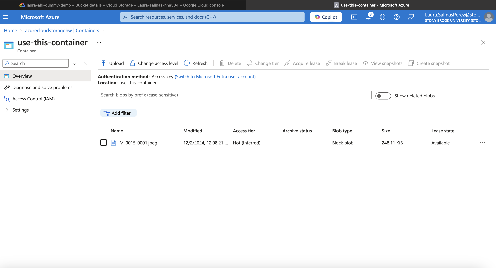
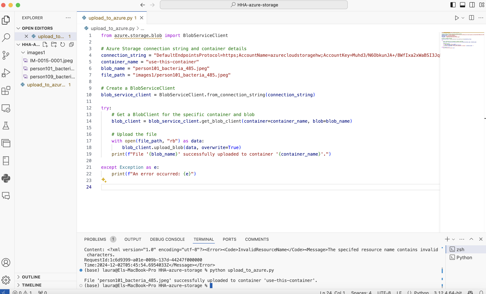
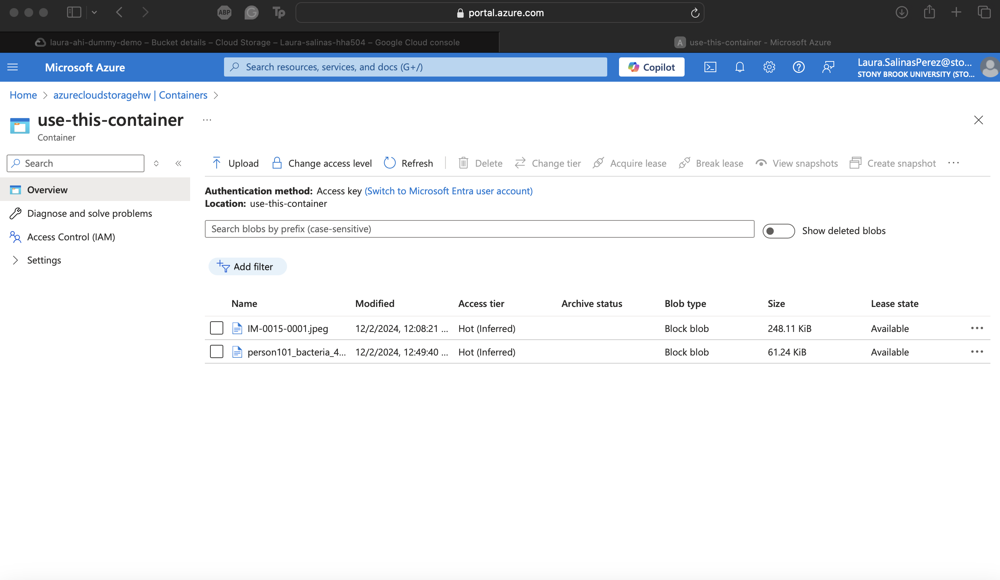
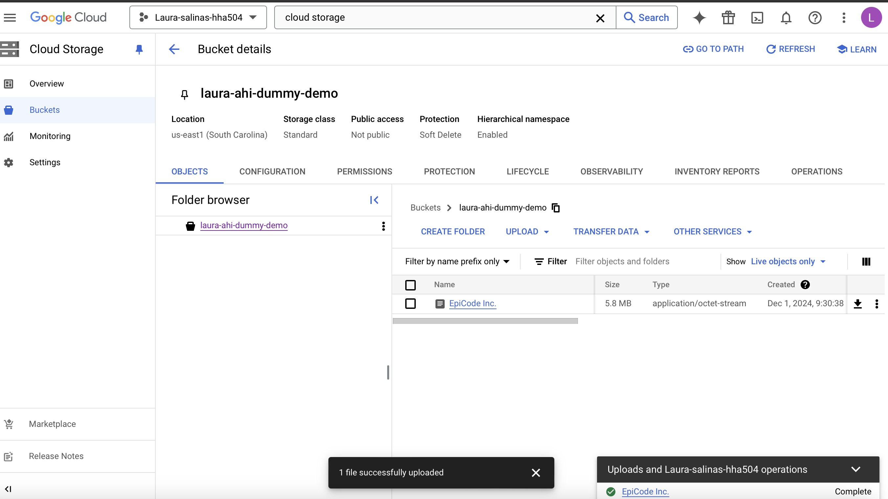
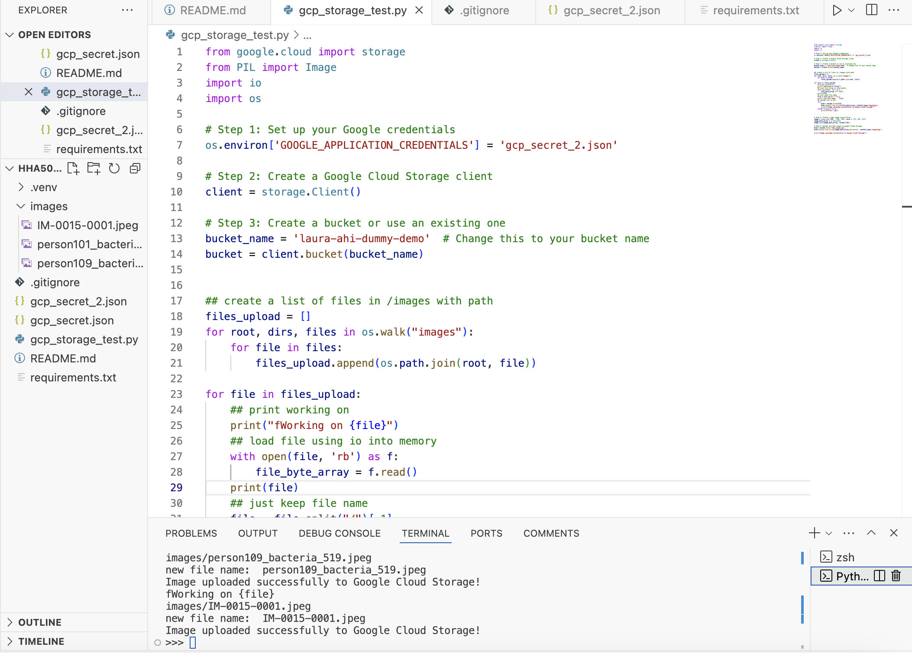
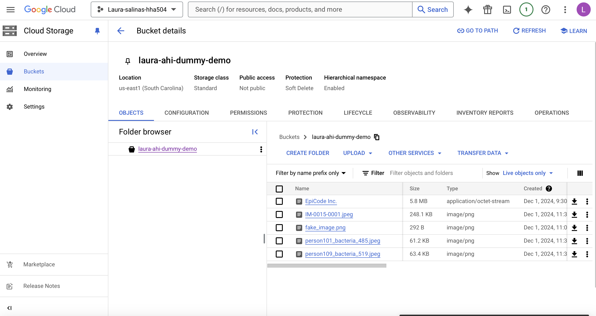

# HHA504 Assignment: Working with Cloud Storage

## 1. File Upload via GUI
### Azure Blob Storage
- Steps to upload a file in Azure Blob Storage:

#### Step 1: Manual Image Upload

#### Step 2: Python Code

#### Step 3: Python Code Success

### GCP Cloud Storage
- Steps to upload a file in GCP Cloud Storage:

#### Step 1: Manual Image Upload

#### Step 2: Python Code

#### Step 3: Python Code Success

