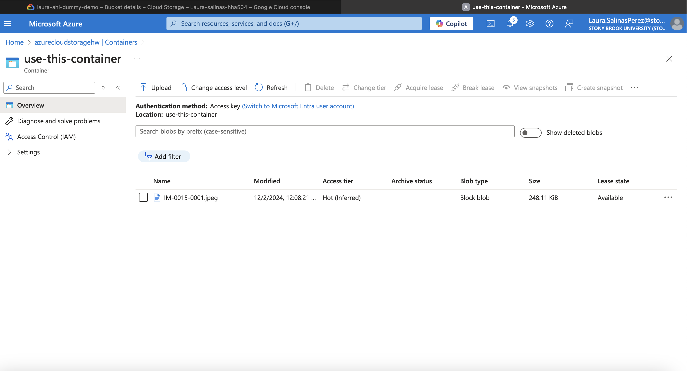
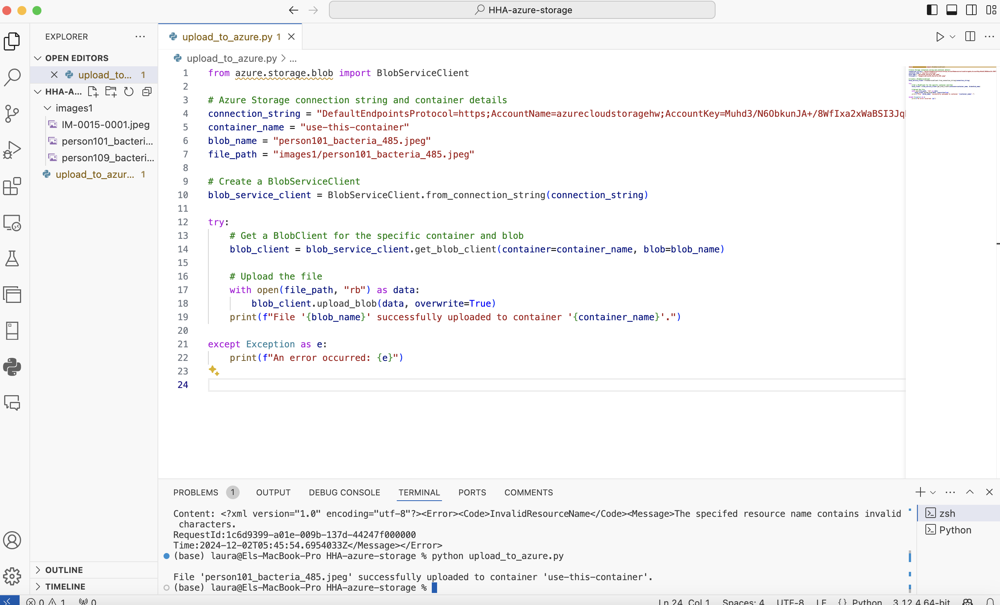
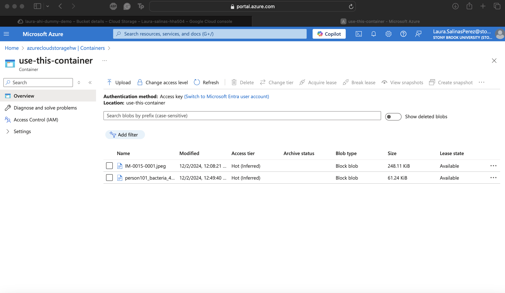
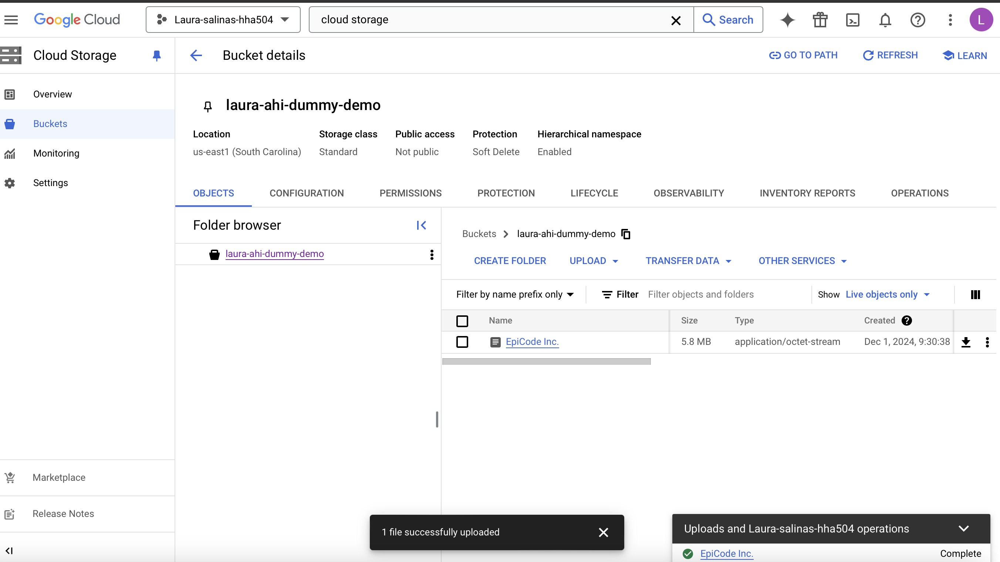
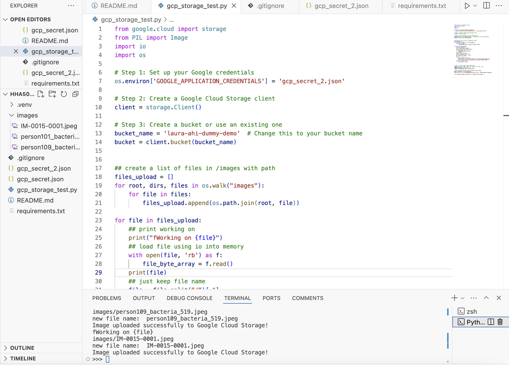
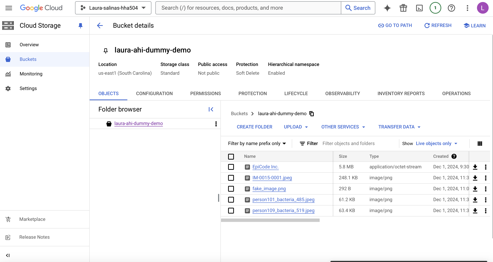

# HHA504 Assignment: Working with Cloud Storage

# 1. File Upload via GUI
# Azure Blob Storage
- Steps to upload a file in Azure Blob Storage:

#### Step 1: Manual Image Upload


#### Step 2: Python Code


#### Step 3: Python Code Success


# GCP Cloud Storage
- Steps to upload a file in GCP Cloud Storage:

#### Step 1: Manual Image Upload


#### Step 2: Python Code


#### Step 3: Python Code Success


 # 2. Python Codes

# Azure Blob Storage:
```python
from azure.storage.blob import BlobServiceClient

# Azure Storage connection string and container details
connection_string = "DefaultEndpointsProtocol=https;AccountName=azurecloudstoragehw;AccountKey=Muhd3/N6ObkunJA+/8WfIxa2xWaBSI3JqDY8nqUw9ffDeJTrgwazE54ciVkpMfpxqsjJ2XqZ1IMt+ASt80iTTQ==;EndpointSuffix=core.windows.net"
container_name = "use-this-container"  
blob_name = "person101_bacteria_485.jpeg" 
file_path = "images1/person101_bacteria_485.jpeg"  

# Create a BlobServiceClient
blob_service_client = BlobServiceClient.from_connection_string(connection_string)

try:
    # Get a BlobClient for the specific container and blob
    blob_client = blob_service_client.get_blob_client(container=container_name, blob=blob_name)

    # Upload the file
    with open(file_path, "rb") as data:
        blob_client.upload_blob(data, overwrite=True)
    print(f"File '{blob_name}' successfully uploaded to container '{container_name}'.")

except Exception as e:
    print(f"An error occurred: {e}")
```

# GCP Cloud Storage:
```python
from google.cloud import storage
from PIL import Image
import io
import os

# Step 1: Set up your Google credentials
os.environ['GOOGLE_APPLICATION_CREDENTIALS'] = 'gcp_secret_2.json'

# Step 2: Create a Google Cloud Storage client
client = storage.Client()

# Step 3: Create a bucket or use an existing one
bucket_name = 'laura-ahi-dummy-demo'  # Change this to your bucket name
bucket = client.bucket(bucket_name)


## create a list of files in /images with path 
files_upload = []
for root, dirs, files in os.walk("images"):
    for file in files:
        files_upload.append(os.path.join(root, file))

for file in files_upload:
    ## print working on
    print("fWorking on {file}") 
    ## load file using io into memory
    with open(file, 'rb') as f:
        file_byte_array = f.read()
    print(file)
    ## just keep file name 
    file = file.split("/")[-1]
    print('new file name: ', file)
    ## upload file to GCS
    try:
        blob = bucket.blob(file)
        blob.upload_from_string(file_byte_array, content_type='image/png')
        print(f"Image uploaded successfully to Google Cloud Storage!")
    except Exception as e:
        print(f"Error: {e}")


# Step 4: Create a fake image using Pillow
image = Image.new('RGB', (100, 100), color = (73, 109, 137))
image_byte_array = io.BytesIO()
image.save(image_byte_array, format='PNG')

# Step 5: Upload the fake image to Google Cloud Storage
blob = bucket.blob('fake_image.png')
blob.upload_from_string(image_byte_array.getvalue(), content_type='image/png')

print("Image uploaded successfully to Google Cloud Storage!")
```
#  3. Storage Management and Security Features
# Azure Blob Storage 

### 1. Access Policies:
Azure Blob Storage provides several ways to control access to your data:
   - Shared Access Signatures (SAS)
   - Stored Access Policies
   - Public Access Level
- Configure containers as:
     - Private: No public access.
     - Blob: Read access to blobs only.
     - Container: Read access to both the container and blobs.
       
### 2. Data Tiers:
Azure Blob Storage provides data tiers to optimize cost and performance based on usage patterns:

- Hot Tier
- Cool Tier
- Archive Tier

### 3. Security Features:
- Data is encrypted using Microsoft-managed or customer-managed keys (CMKs).
- Integration with Azure Key Vault for managing keys.
- Uses HTTPS for secure data transfer.
- Role-Based Access Control (RBAC) for fine-grained permissions.
- Avoids sharing account keys by assigning roles.
- Firewall and Virtual Network Integration

# Google Cloud Platform (GCP) Cloud Storage 

### 1. IAM Permissions:
GCP Cloud Storage uses Identity and Access Management (IAM) for granular access control.
- Roles:
  - Storage Admin
  - Storage Object Viewer
  - Storage Object Creator
    - Custom roles can be defined for specific permissions.
- Service Accounts:
  - Use service accounts with specific IAM roles for applications.

### 2. Lifecycle Rules:
Lifecycle rules help automate the management of objects based on conditions.

- Supported Actions:
  - Transition objects to a cheaper storage class 
  - Delete objects after a specific time period.
  - Retain objects for compliance purposes using Object Retention.
 ##### Conditions
  Rules can be based on:
  - Object age.
  - Creation date.
  - Storage class.
  - Object name prefix.
### 3. Security Features:

- Data is encrypted using Google-managed or customer-supplied encryption keys (CSEK).
- Option to use customer-managed keys (CMEK) with Google Cloud Key Management Service (KMS).
- Data is automatically encrypted during transfer using HTTPS or Transport Layer Security (TLS).
- Defines conditions for access, such as IP restrictions or required authentication.
- Maintain versions of objects for recovery or rollback in case of accidental deletion.
- Monitor access and operations using Google Cloud’s audit logs.

